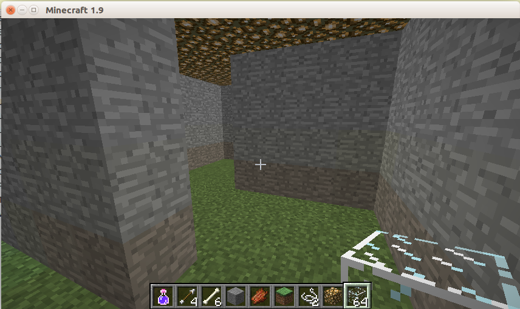
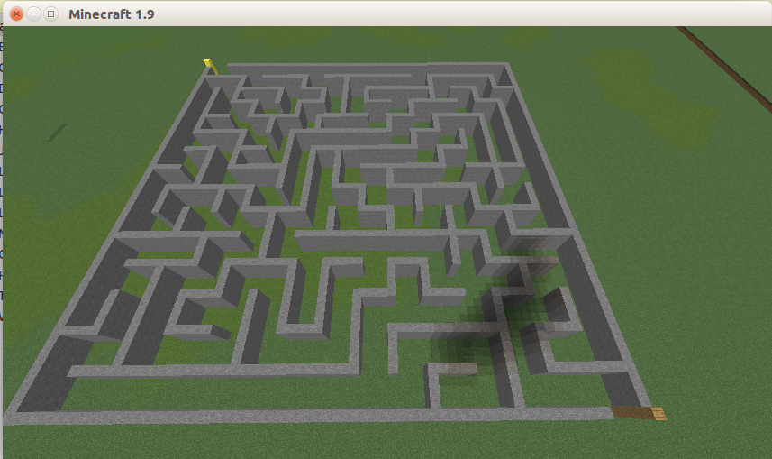

# R Minecraft Maze

Example code to produce mazes for the popular Minecraft game.  This is
very superficial code but you may find it useful for you own hacking.

## Requirements:

* Minecraft server.  I used the server setup as described in
  [Learn to Program in Minecraft](https://www.nostarch.com/download/LTPWM_ch01_update_online.pdf).
  Note: there is no linux version available for download.  The mac
  version worked just fine for me.
  
* I also installed Minecraft python API (the command is there in the
  mac package.)  I don't know if this is needed.
  
* [_Rmaze_](https://github.com/Vessy/Rmaze) package by Vessy

The Rmaze package is slow for large mazes, but to have fun in
Minecraft, 12x12 is quite a lot.

Enjoy :-)

Ott

